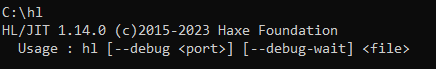
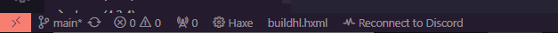

# Fraps / FNF on Heaps

A brand new Friday Night Funkin' engine made exclusively for hardcoding. A major drawback of most FNF engines nowadays are severe lack of source code documentation, source modding, and their insistence on using softmodding to work with them. A lot of them also include all of the Base Game assets, which clutter up your repo and the code.

(As of writing, Fraps is aiming to recreate B-Side Redux as a form of reference. Most if not all assets from it will be removed after completion.)

---

## What is Heaps?

Heaps is a cross-platform game engine built by Nicolas Cannasse, the original creator of the Haxe compiler and designer for the Haxe language.

Primarily used by Shiro Games, it is open source, but not community driven. Features are implemented as needed, so if something you want / need is not already part of Heaps, you will most likely need to implement it yourself.

Heaps is NOT for people who don't know how to work with a low level engine, unlike Flixel where most of the heavy lifting is done for you when it comes to setting up.

Most of this also applies to Fraps itself. It is made by me (Glintfish) for my own personal use, used for my own mods, and I do not recommend it to people who don't know what they're doing.

# Installing Fraps

First off, you ***HAVE*** to install Haxe that is version 4.3 or higher. I'd recommend using version [4.3.4](https://haxe.org/download/version/4.3.4/), as thats the version I'm using.

You'll then have to install Hashlink. Its a tiny bit more annoying to set up though.

First off, go to the [Hashlink website](https://hashlink.haxe.org/#download) and click "Download latest binary release". This will take you to the GitHub releases. Download the latest version of Hashlink (NOT the Nightly Build). 
Once it's installed, make a folder somewhere (doesn't matter where, but it should probably go into the same folder as your haxe install).

- Extract the files from the ZIP into the folder.
- Copy the path of the folder.
- Press the Windows key and type in "System variables".
- At the bottom of the window, click "Environment Variables".
- Find `Path` (either for the User or System).
- Click it and click Edit.
- In the new window, click New and paste the path of the folder where Hashlink is installed

To confirm you have Hashlink installed and correctly configured, open up Command Prompt and type in ``hl``. You should get something like this

After installing Haxe and Hashlink, you will need to install Heaps and its dependencies.

Paste these into Command Prompt:

- ``haxelib install hlopenal``
- ``haxelib install hlsdl``
- ``haxelib install hldx``

And specifically for Fraps, you'll need [Slide](https://lib.haxe.org/p/slide/)

- ``haxelib install slide 0.2.2``

You're almost done!

## Configuring VSCode
While VSCode isn't a necessity, it is generally the most recommended for Haxe development, as it is the most supported. If you don't want to use VSCode, feel free to skip these steps, although most of the tutorial will assume you're using it.

To work with Fraps (or any Haxe / Heaps project), you'll need to install a few extensions. Those being:
- Haxe
- Haxe Extension Pack

And that's it!

# Compiling Fraps

After cloning the repository and configuring VSCode, extract the files into a folder, then open the project in VSCode.

The main thing we care about are `buildhl.hxml` and `buildc.hxml`. These are the files that shorten down our compiler arguments when compiling, and makes compiling a breeze.

In the bottom left of the VSCode window, you should see something like this:

If not already, change `buildhl.hxml` to... `buildhl.hxml`. That is your configuration for compiling. `buildhl.hxml` tells Haxe that you want to compile the program to the Hashlink target, while `buildc.hxml` readies the game to be compiled to C.

(A section on compiling to C will be added later)

Whenever you want to compile, press the F5 key, and after a few seconds, the engine will run! Hooray!

You're now ready to start modding Fraps.

# Quick PS

Fraps is still early in development. It is NOT meant to be used for mods at the moment, as there is still LOTS to be done. Be patient please :]